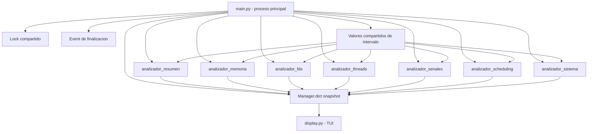

# TP1 - Monitor de Procesos en Linux

Trabajo practico de Computacion II desarrollado en Python sobre GNU/Linux.

El objetivo del proyecto es implementar un monitor de procesos que obtiene informacion real del sistema leyendo directamente el pseudo-filesystem `/proc`, sin utilizar herramientas externas como `ps`, `top`, `htop`, `psutil`, `subprocess` o librerias equivalentes.

---

## 1. Objetivos del proyecto

El objetivo principal del trabajo es construir una herramienta de monitoreo que permita observar distintos aspectos del sistema operativo Linux desde una interfaz de texto interactiva.

El programa permite:

- Listar procesos activos del sistema.
- Calcular CPU por proceso usando diferencias entre lecturas.
- Calcular CPU global usando diferencias desde `/proc/stat`.
- Mostrar informacion de memoria por proceso.
- Leer y clasificar segmentos de memoria desde `/proc/<pid>/maps`.
- Inspeccionar file descriptors abiertos por proceso.
- Mostrar informacion de threads.
- Visualizar señales bloqueadas, ignoradas y capturadas.
- Mostrar informacion de scheduling.
- Manejar señales del sistema desde el proceso principal.
- Ejecutar analizadores en procesos separados usando `multiprocessing`.
- Ajustar intervalos de refresco en caliente usando `multiprocessing.Value`.
- Navegar la interfaz mediante keybindings.

---

## 2. Arquitectura general

El monitor esta dividido en un proceso principal y varios procesos analizadores.

El proceso principal se encarga de:

- Inicializar la configuracion.
- Crear las estructuras compartidas.
- Lanzar los analizadores.
- Mostrar la interfaz de texto.
- Leer el teclado sin bloquear.
- Procesar señales.
- Detener los procesos hijos de forma ordenada.

Los analizadores corren en procesos separados y escriben sus resultados en un `Manager.dict` compartido llamado `snapshot`.



---

## 3. Estructura del proyecto

```text
TP1/
├── Dockerfile
├── docker-compose.yml
├── requirements.txt
├── config.json
├── README.md
├── dudas.md
├── src/
│   ├── main.py
│   ├── procfs.py
│   ├── display.py
│   ├── configuracion.py
│   ├── senales.py
│   └── analizadores/
│       ├── resumen.py
│       ├── memoria.py
│       ├── fds.py
│       ├── threads.py
│       ├── senales.py
│       ├── scheduling.py
│       └── sistema.py
└── tests/
    └── test_procfs.py
```


## 4. Vistas implementadas
La interfaz permite cambiar entre siete vistas principales:
| Vista            | Tecla     | Descripcion                                                                |
| ---------------- | --------- | -------------------------------------------------------------------------- |
| Resumen          | `1` o `r` | Muestra procesos con PID, PPID, usuario, estado, threads, CPU% y RSS       |
| Memoria          | `2` o `m` | Muestra memoria por proceso y segmentos obtenidos desde `/proc/<pid>/maps` |
| File descriptors | `3` o `f` | Lista FDs abiertos por proceso                                             |
| Threads          | `4` o `t` | Muestra threads asociados a procesos                                       |
| Señales          | `5` o `s` | Muestra mascaras de señales bloqueadas, ignoradas y capturadas             |
| Scheduling       | `6` o `p` | Muestra politica, prioridad y datos de scheduling                          |
| Sistema          | `7` o `g` | Muestra CPU global, memoria global, load average, procesos y uptime        |


## 5. Keybindings de la TUI
La interfaz lee teclado en modo no bloqueante usando select, termios y tty.

Keybindings disponibles:
| Tecla           | Accion                                                             |
| --------------- | ------------------------------------------------------------------ |
| `1-7`           | Cambiar de vista                                                   |
| `r/m/f/t/s/p/g` | Cambiar de vista por letra                                         |
| `+`             | Acelerar el analizador de la vista actual bajando su intervalo     |
| `-`             | Desacelerar el analizador de la vista actual subiendo su intervalo |
| Flecha arriba   | Mover seleccion hacia arriba                                       |
| Flecha abajo    | Mover seleccion hacia abajo                                        |
| `Enter`         | Fijar o desfijar el PID seleccionado en el panel de detalle        |
| `/`             | Activar filtro de busqueda                                         |
| `u`             | Marcar actualizacion manual                                        |
| `c`             | Limpiar filtro, seleccion y proceso fijado                         |
| `h` o `?`       | Mostrar u ocultar ayuda                                            |
| `q`             | Salir del monitor                                                  |


## 6. Decisiones de diseño
Uso de /proc

Se decidio leer directamente archivos del pseudo-filesystem /proc para obtener informacion real del sistema operativo. Esto permite trabajar con los datos que expone Linux sin depender de comandos externos.

Archivos utilizados:

/proc/<pid>/stat
/proc/<pid>/status
/proc/<pid>/cmdline
/proc/<pid>/fd
/proc/<pid>/task
/proc/<pid>/maps
/proc/stat
/proc/meminfo
/proc/loadavg
/proc/uptime

Separacion por analizadores

Cada vista tiene un analizador propio. Esto permite separar responsabilidades y mantener el codigo mas claro.

Por ejemplo:

- resumen.py calcula informacion general de procesos.
- memoria.py obtiene datos de memoria.
- fds.py analiza file descriptors.
- threads.py analiza threads.
- senales.py interpreta mascaras de señales.
- scheduling.py analiza politica y prioridad.
- sistema.py calcula metricas globales del sistema.

Uso de multiprocessing

Los analizadores corren como procesos separados usando multiprocessing.Process. Esto permite que cada analizador actualice su informacion de forma independiente.

Para compartir informacion se usan:

- Manager.dict para el snapshot global.
- RLock para proteger lecturas y escrituras.
- Event para detener los procesos.
- multiprocessing.Value para intervalos modificables en caliente.

Intervalos dinamicos

Cada analizador tiene un multiprocessing.Value propio que guarda su intervalo de refresco. Desde la TUI se puede modificar el intervalo del analizador asociado a la vista actual con + y -.

Los analizadores leen ese valor dentro de cada vuelta del ciclo. De esta forma, si el proceso principal modifica el intervalo, el proceso hijo ve el cambio sin reiniciarse.

Calculo de CPU por delta

El CPU por proceso se calcula comparando dos lecturas sucesivas de ticks de CPU:
cpu_pct = delta_ticks / (delta_tiempo * clock_ticks) * 100

Los ticks del proceso se obtienen sumando utime + stime desde /proc/<pid>/stat.

Calculo de CPU global por delta

La CPU global se calcula leyendo /proc/stat y comparando dos muestras sucesivas. No se usa el acumulado desde el arranque, sino la diferencia entre ventanas de tiempo.

El uso se calcula como:
uso = total - idle - iowait
uso_pct = uso / total * 100

Segmentos de memoria desde maps

Para analizar memoria se lee /proc/<pid>/maps.

Cada linea contiene un rango de direcciones virtuales. Se calcula el tamaño restando direccion inicial y final, y se agrupa segun:

- [heap] para heap.
- [stack] para stack.
- permiso x para segmentos de codigo/text.
- permiso w sin x para data.
- permiso s para memoria compartida.

## 7. Conceptos del curso aplicados
En el trabajo se aplican varios conceptos de sistemas operativos vistos en Computacion II:

- Procesos y PIDs.
- Procesos padre e hijo.
- Threads.
- Estados de procesos.
- Planificacion y prioridades.
- File descriptors.
- Señales POSIX.
- Mascaras de señales.
- Memoria virtual.
- Segmentos de memoria.
- Pseudo-filesystems.
- Concurrencia.
- Sincronizacion con locks.
- Comunicacion entre procesos.
- Manejo ordenado de finalizacion.

## 8. Señales implementadas
El proceso principal instala manejadores livianos para señales.
| Señal      | Accion                          |
| ---------- | ------------------------------- |
| `SIGINT`   | Finalizar el monitor            |
| `SIGTERM`  | Finalizar el monitor            |
| `SIGHUP`   | Recargar configuracion          |
| `SIGUSR1`  | Generar dump del snapshot       |
| `SIGUSR2`  | Activar/desactivar modo verbose |
| `SIGWINCH` | Repintar pantalla               |

Los handlers no realizan trabajo pesado directamente. Solo modifican flags de control. Luego el loop principal procesa esas acciones de forma segura.

## 9. Ejecucion
Con Docker Compose

Construir la imagen:
docker compose build

Ejecutar el monitor:
docker compose run --rm monitor

Ejecutar tests:
docker compose run --rm monitor pytest -q

Ejecucion local

Desde la carpeta TP1:
python3 src/main.py

## 10. Pruebas realizadas
Se realizaron las siguientes pruebas:

- Compilacion de archivos Python con py_compile.
- Ejecucion de tests automatizados con pytest.
- Ejecucion del monitor usando Docker Compose.
- Cambio entre vistas 1-7.
- Cambio entre vistas con letras r/m/f/t/s/p/g.
- Ajuste de intervalos con + y -.
- Verificacion visual de que el intervalo cambia en pantalla.
- Prueba de filtro con /.
- Movimiento de seleccion con flechas.
- Fijado de proceso con Enter.
- Limpieza de filtro y seleccion con c.
- Visualizacion de ayuda con h y ?.
- Salida ordenada con q.

## 11. Limitaciones conocidas
- El monitor depende de la estructura de /proc, por lo que esta pensado para sistemas GNU/Linux.
- Algunos archivos de /proc/<pid> pueden desaparecer mientras se leen si el proceso termina.
- Algunos datos pueden no estar disponibles por permisos del usuario.
- El calculo de CPU necesita al menos dos muestras para mostrar porcentajes representativos.
- La interfaz es de texto y no busca reemplazar herramientas completas como top o htop.
- El filtro es simple y se aplica sobre texto basico de cada proceso.
- El panel de detalle muestra informacion resumida del proceso seleccionado o fijado.

## 12. Correcciones realizadas luego de la devolucion

Luego de la devolucion se realizaron las siguientes correcciones:

- Se corrigio el calculo de CPU por proceso usando delta entre lecturas.
- Se corrigio el calculo de CPU global usando delta desde /proc/stat.
- Se agrego lectura y clasificacion de /proc/<pid>/maps.
- Se conectaron los multiprocessing.Value con los procesos hijos.
- Se agrego lectura dinamica del intervalo dentro de los analizadores.
- Se agregaron keybindings faltantes.
- Se agrego panel de detalle con seleccion, filtro y pin de procesos.
- Se elimino src/recolector.py porque estaba vacio y no formaba parte del diseño final.
- Se actualizo el README para que funcione como informe tecnico del TP.